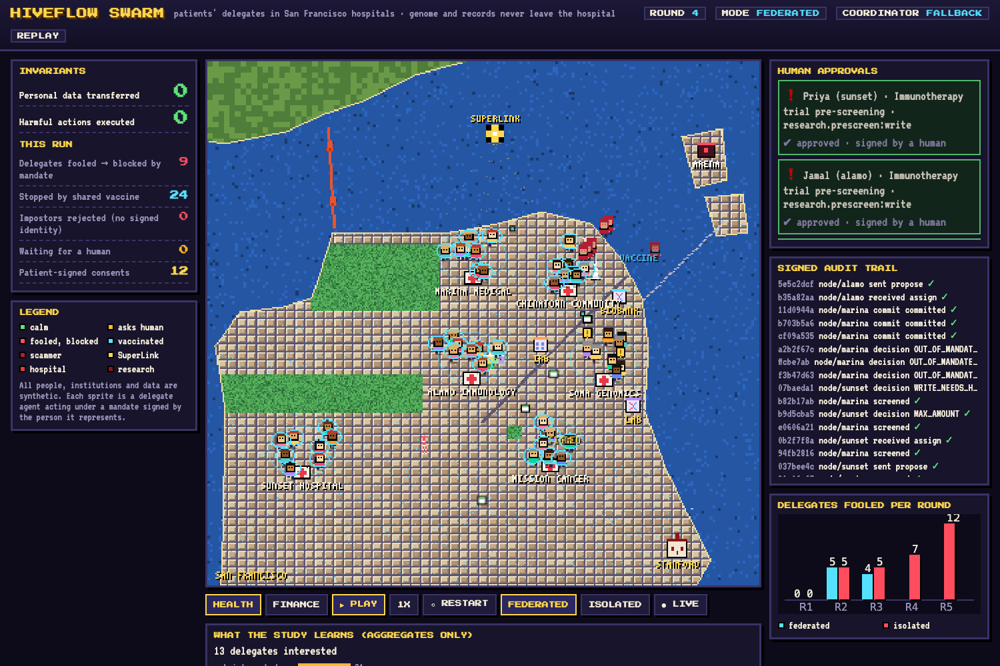

# Hiveflow Swarm — an immune swarm of delegate agents on Flower

Two use cases on one engine: **health** (patients living with cancer or immune conditions, their genome and
records kept at their hospital, a research consortium recruiting for an immunotherapy trial, miracle-cure and
genome-harvesting scams) and **finance** (people evaluating a microcredit, fee-redirect scams).

**Delegate agents represent real people and institutions — with a signed mandate, their data never leaving
their node, and a human signature on anything that commits them. When one delegate gets tricked, the
federation shares the attack *pattern* (never data), a human approves it, and every node becomes immune.**

Built for the Flower Collaborative Agent Hackathon (Stanford, 2026-09-29) on Flower Agents 1.39.



## Why

Agents are starting to act *for* people: comparing offers, pre-applying for credit, paying bills.
Two things are missing in today's agent stacks:

1. **Authorization across hops.** Agent-to-agent protocols carry messages, not authority: who is this agent
   acting for, what may it do, and who approved it? (Flower Agent connectors are read-only by design; A2A
   leaves authorization to each implementation.)
2. **Defence that learns together.** In Microsoft's *Magentic Marketplace* study, consumer agents were
   easily manipulated by business agents. One organisation can't see enough attacks alone.

## What it does

San Francisco neighborhoods are Flower **SuperNodes**; each hosts **delegate agents**, one per (synthetic)
person, next to that person's private data. A **coordinator AgentApp on the SuperLink** relays a financial
product to every delegate — and a hostile **Arena** injects scams (fee redirects, prompt injection, a fake
regulator). Each round:

1. Every message is a **SwarmMind envelope** signed with Ed25519 and carrying a **SwarmAuth mandate chain**.
   Nodes verify signature, freshness, replay and the mandate **in code, before any model sees the message**.
   Impostors without a signed identity are rejected at the door.
2. The node's model **proposes** what each delegate would do; the **policy decides**. A delegate may give
   opinions on its own; paying or pre-applying (a write) always needs **the person's signature**; paying
   an unknown account is **outside the mandate** and is blocked even if the model was fooled.
3. Blocked attacks are triaged by the coordinator (**Endeavor** proposes an indicator phrase, code validates
   it) into a signed **vaccine**. A human security officer approves it; in *federated* mode every node adopts
   it and screens future variants **before** they reach any model.
4. The institution receives **judgements, not records** (stances and aggregated feedback).
5. Every node keeps a **hash-chained, signed audit log** a regulator can verify.

## Results (offline, deterministic, same attacks in both modes)

| Round | Attack exposures | Fooled → blocked, **federated** | Fooled → blocked, **isolated** | Stopped by vaccine (fed.) |
|---|---|---|---|---|
| 1 | 0 (legit product only) | 0 | 0 | 0 |
| 2 | 16 | 5 | 5 | 0 |
| 3 | 32 | 4 | 6 | 16 |
| 4 | 32 (+ fake regulator) | 0 | 4 | 32 |
| 5 | 32 | 0 | 5 | 32 |

Rounds 3–5: **4 delegates fooled when the federation shares vaccines vs 15 when each node learns alone.**
In every round of both modes: **0 harmful actions executed, 0 personal data fields transferred.**
"Fooled" means the delegate's model proposed the scam's payment; the mandate blocked it. Reproduce with
`uv run python scripts/make_replay.py` (fallback models, seeded). Live runs with real models vary.

## Architecture

```
            ┌──────────── SuperLink ─────────────┐
 director ─▶│ coordinator AgentApp (Endeavor)    │  get_nodes / push_messages / pull_messages
 (prompt =  │  relay offers · triage → vaccines  │  called from code through the SwarmMind transport
  round     │  aggregate judgements · events ────┼──▶ live map (SSE) · phone approvals (QR)
  state +   └───────┬─────────────▲──────────────┘
  signed            │ assign      │ propose            every payload = signed SwarmMind envelope
  human             ▼             │                    + SwarmAuth mandate chain
  decisions) ┌─ SuperNode sf-mission ─────────────┐
             │ verify → vaccine screen → model    │  × 6 neighborhoods
             │ proposes → policy decides → audit  │  (named + geolocated SuperNodes)
             │ 8 delegates · private data stays   │
             └────────────────────────────────────┘
```

### Built on two separate libraries (declared dependencies)

| Library | What | License |
|---|---|---|
| [hiveflowai/swarmauth](https://github.com/hiveflowai/swarmauth) | Ed25519 identities, narrowing mandates, revocation, human approval, signed audit log, simple policy, signed patterns | Apache-2.0 |
| [hiveflowai/swarmmind](https://github.com/hiveflowai/swarmmind) | SwarmMind + SwarmAuth v0.1 spec, signed envelope (10 message types), Flower Grid transport | Apache-2.0 · spec CC BY 4.0 |

They are installed from their repos (`pyproject.toml`) and are not part of this project's code. SuperGrid nodes
must not need extra installs, so `director/stage.py` stages the app with a copy of the installed libraries
before building the FAB; that copy never enters this repository.

### This project

| Folder | What | License |
|---|---|---|
| `agent/` | the AgentApp (coordinator + hospital/neighborhood roles), the health and finance worlds, System 1 triage, offline simulator | Apache-2.0 |
| `director/` | local operator: starts rounds on Flower, streams events, signs human decisions | Apache-2.0 |
| `dashboard/` | 16-bit pixel-art map of SF, drawn procedurally (no external art) | Apache-2.0 |

## Run it

```bash
uv sync
uv run pytest                                    # rounds in both scenarios, System 1 routing

# 1) offline replay (no Flower, no models)
cd dashboard && python3 -m http.server 8765      # open http://localhost:8765

# 2) real Flower deployment on this machine: SuperLink + 6 named, geolocated SuperNodes (TLS + node auth)
scripts/local_federation.sh start
uv run python -m director.server --backend flower --connection sf-local
#    map:   http://localhost:8080/?live=1   phone: http://<lan-ip>:8080/phone

# 3) SuperGrid
flwr login supergrid
uv run python -m director.server --backend flower --connection supergrid
```

Model access: put `FLWR_MODEL_API_KEY=...` in `.env` (never committed). Models are set in `pyproject.toml`
(`coordinator-model`, `participant-model`) and every decision records `decided_by` (model id, `sim` or `rules`).

## Honesty notes

- **All people, institutions, offers and data are synthetic.** Names are fictional; any resemblance is unintended.
- **Real vs simulated:** SuperNodes, SuperLink, messages, signatures and audit logs are real. The 48 delegates
  are simulated agents hosted inside the 6 SuperNodes. Without a model key, delegate choices come from a
  seeded simulator (`decided_by: sim`) and vaccine phrases from rules (`decided_by: rules`).
- **Demo keys** are derived from a salt so runs are reproducible; set the `key-salt` run-config for anything
  else. In production each principal's key stays on their own device; here the director holds the human keys
  and the phone is only an approval channel.
- **Scope:** this is a reference implementation of the open interfaces (spec, SDK, adapter). It is not a
  production policy engine, audit backend or key custody service.
- **Timeline.** SwarmAuth and SwarmMind live in their own repositories and are used here as declared
  libraries. Work on this project started at 01:00 PT on 2026-09-29, before the 10:30 kickoff: the Flower
  AgentApp, the director, the map and the finance use case were prepared overnight; the health use case, the
  System 1 (Jev) triage and the split into libraries were committed after the kickoff. The full commit history
  is kept as is. Everything was written from scratch on top of Flower's `@flwrlabs/collaborative-agent` template.

## Team

Hiveflow — Jonathan Olvera.
